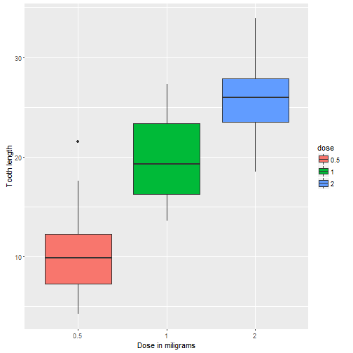

# Statistical Inference: Part 2
Basic inferential data analysis
==========================================
#### Atit Doctor
##### February 18, 2016


## Load necessary packages

```r
library(ggplot2)
```

In this report we will analyse the ToothGrowth data in the R data sets package. The data is set of 60 observations, length of odontoblasts (teeth) in each of 10 guinea pigs at each of three dose levels of Vitamin C (0.5, 1 and 2 mg) with each of two delivery methods (orange juice or ascorbic acid).

## Loading the data

```r
data(ToothGrowth)
str(ToothGrowth)
```

```
## 'data.frame':	60 obs. of  3 variables:
##  $ len : num  4.2 11.5 7.3 5.8 6.4 10 11.2 11.2 5.2 7 ...
##  $ supp: Factor w/ 2 levels "OJ","VC": 2 2 2 2 2 2 2 2 2 2 ...
##  $ dose: num  0.5 0.5 0.5 0.5 0.5 0.5 0.5 0.5 0.5 0.5 ...
```

```r
head(ToothGrowth)
```

```
##    len supp dose
## 1  4.2   VC  0.5
## 2 11.5   VC  0.5
## 3  7.3   VC  0.5
## 4  5.8   VC  0.5
## 5  6.4   VC  0.5
## 6 10.0   VC  0.5
```

## Data Summary

```r
summary(ToothGrowth)
```

```
##       len        supp         dose      
##  Min.   : 4.20   OJ:30   Min.   :0.500  
##  1st Qu.:13.07   VC:30   1st Qu.:0.500  
##  Median :19.25           Median :1.000  
##  Mean   :18.81           Mean   :1.167  
##  3rd Qu.:25.27           3rd Qu.:2.000  
##  Max.   :33.90           Max.   :2.000
```

## Correct Variables

```r
ToothGrowth$dose<-as.factor(ToothGrowth$dose)
```


## Exploratory Analysis
Verify the mean of the len variable by supply method and creating the corresponding histogram

```r
MeanSupp = split(ToothGrowth$len, ToothGrowth$supp)
sapply(MeanSupp, mean)
```

```
##       OJ       VC 
## 20.66333 16.96333
```

```r
ggplot(aes(x=supp, y=len), data=ToothGrowth) + geom_boxplot(aes(fill=supp))+ 
        xlab("Supplement type") +ylab("Tooth length") 
```


## Checking the effect of vitamin C dose on tooth length.

```r
MeanDose = split(ToothGrowth$len, ToothGrowth$dose)
sapply(MeanDose, mean)
```

```
##    0.5      1      2 
## 10.605 19.735 26.100
```

```r
ggplot(aes(x=dose, y=len), data=ToothGrowth) + geom_boxplot(aes(fill=dose)) + 
        xlab("Dose in miligrams") +ylab("Tooth length") 
```




## Inferential Statistics
Do the teeth length of the guinea pigs depends on delivery methods? 

A t-test for the difference will be made to test this claim.

```r
len<-ToothGrowth$len
supp<-ToothGrowth$supp
dose<-ToothGrowth$dose

sapply(MeanSupp, var)
```

```
##       OJ       VC 
## 43.63344 68.32723
```

```r
t.test(len[supp=="OJ"], len[supp=="VC"], paired = FALSE, var.equal = FALSE)
```

```
## 
## 	Welch Two Sample t-test
## 
## data:  len[supp == "OJ"] and len[supp == "VC"]
## t = 1.9153, df = 55.309, p-value = 0.06063
## alternative hypothesis: true difference in means is not equal to 0
## 95 percent confidence interval:
##  -0.1710156  7.5710156
## sample estimates:
## mean of x mean of y 
##  20.66333  16.96333
```

The p-value of this test was 0.0606, which is very close to the significance level of 5%. 

This could be interpreted as a lack of enough evidence to reject the null hypothesis, however it is very important to account that the 0.05 value of significance is only a convenience value and not the exact value.Furthermore, the confidence interval of the test contains zero (0)


Now we will test the tooth length of the group with vitamin C dosage.


```r
t.test(len[dose==2], len[dose==1], paired = FALSE, var.equal = TRUE)
```

```
## 
## 	Two Sample t-test
## 
## data:  len[dose == 2] and len[dose == 1]
## t = 4.9005, df = 38, p-value = 1.811e-05
## alternative hypothesis: true difference in means is not equal to 0
## 95 percent confidence interval:
##  3.735613 8.994387
## sample estimates:
## mean of x mean of y 
##    26.100    19.735
```

The p-value of this test is close to 0 (0.00001811), which provides requisite evidence that we can reject the null hypothesis. Therefore we can assume that the means of dosage change from 1mg to 2mg creates an positive effect on teeth length. 

After the above analysis we can conclude that supplement type has no effect on teeth growth, and increasing the dose level leads to increased teeth growth.
